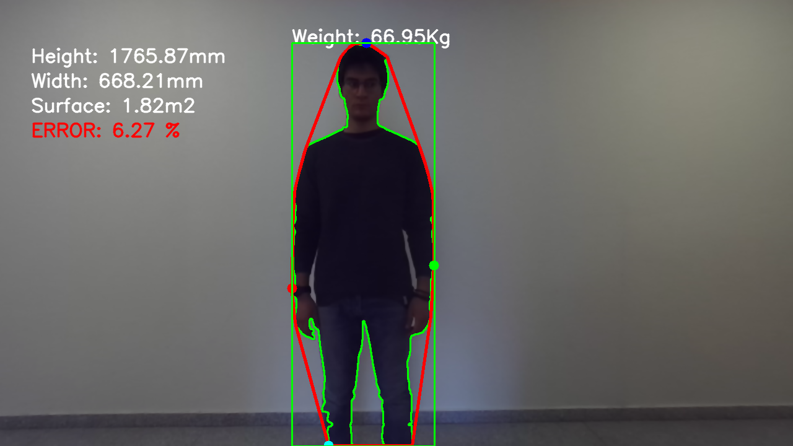

# Weight Estimation with Stereo Camera
This is the code relative to the CV Project @UNITN.
The main purpose of this work is to estimate the weight of a person situated in front of the camera.

### Small Example



### Run

In order to run the application we need to write down the following code in the terminal:

```
Python3 test.py person_name weight_in_kg
```
